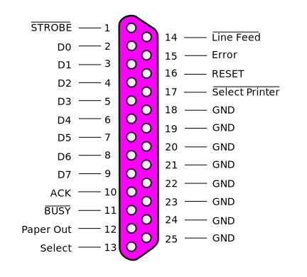
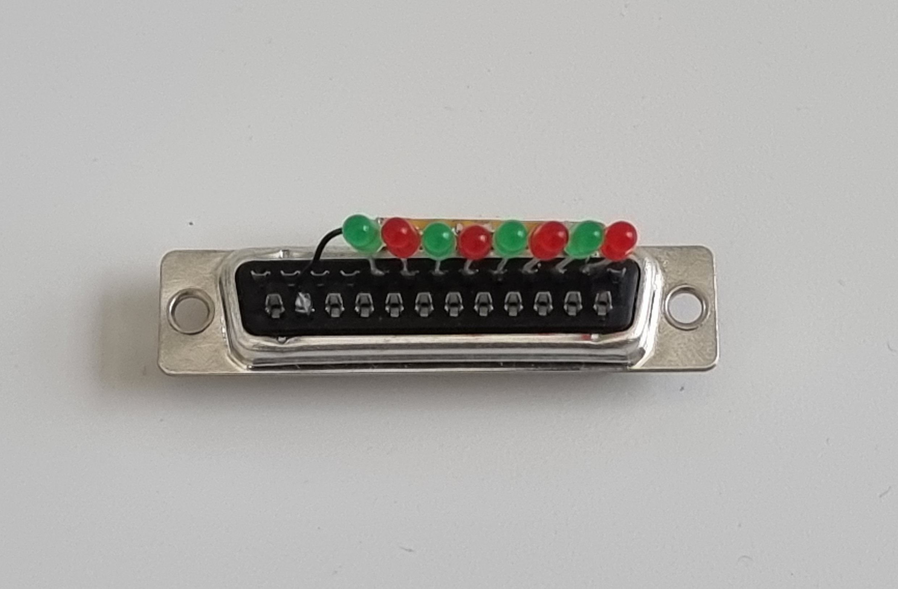

.. include:: ./links.inc

Parallel Port Trigger
=====================

Parallel ports (DB25) are commonly used to deliver triggers to EEG systems. The 8 data
pins ``D0`` to ``D7`` are used to deliver a TTL pulse on 8 bits, thus allowing for
255 different triggers (1-255) with the 0 value being reserved for the absence of a
trigger.

However, parallel ports are not common anymore on modern computers. To use a parallel
port, you can either use a PCIe card or a USB-to-parallel port adapter. The platform
provides those adapters using an arduino micro board.

Arduino to parallel port adapter
--------------------------------

The arduino micro board is used to convert the USB signal to a parallel port signal.
Documentation about the board design can be found on the `arduino-trigger`_ repository.
The converter doesn't add any overhead, latencies are similar to an on-board parallel
port.

Testing parallel port triggers
------------------------------

To test parallel port triggers, the platform provides small testers with a DB-25
connector where the 8 data pins are connected to 8 LEDs. When a TTL signal is received,
the corresponding LED lights up.

Delivering triggers
-------------------

Parallel port triggers can be controlled by many different software. Specificity might
differ on the software but usually you will need to specify the port address. The
address can be found in the device manager (Windows) or with ``ls -l /dev/parport*``
(Linux).

.. tab-set::

    .. tab-item:: Python

        The platform provides `byte_triggers`_ or `stimuli`_ to send triggers in
        paradigm using the objects:

        - :class:`~byte_triggers.MockTrigger` (for testing purposes)
        - :class:`~byte_triggers.LSLTrigger` (for software triggers)
        - :class:`~byte_triggers.ParallelPortTrigger` (for hardware triggers)

        .. tab-set::

            .. tab-item:: Windows address

                .. code-block:: python

                    from byte_triggers import ParallelPortTrigger

                    trigger = ParallelPortTrigger(0x2FB8)  # hexadecimal address
                    trigger.signal(101)

                .. note::

                    Microsoft redistributables and the
                    :download:`inpoutx64.dll <./_static/downloads/inpoutx64.dll>`
                    file in ``C:\Windows\system32`` may be required.

            .. tab-item:: Linux address

                .. code-block:: python

                    from byte_triggers import ParallelPortTrigger

                    trigger = ParallelPortTrigger("/dev/parport0)  # path address
                    trigger.signal(101)

            .. tab-item:: Arduino

                .. code-block:: python

                    from byte_triggers import ParallelPortTrigger

                    trigger = ParallelPortTrigger("arduino")  # arduino auto-detection
                    trigger.signal(101)

        .. note::

            :class:`~byte_triggers.ParallelPortTrigger` automatically resets the
            parallel port to ``0`` after each trigger, in a separate thread. This avoids
            blocking the main thread. The default reset delay is set to ``10 ms``.

    .. tab-item:: MATLAB (windows)

        1. Download :download:`io64.mexw64 <./_static/downloads/io64.mexw64>`
           in your MATLAB path
        2. In MATLAB, use the following code to send triggers between ``1`` and ``255``:

        .. code-block:: matlab

            %% Initialize the parallel port object
            address = hex2dec("2FB8");  % hexadecimal address
            ioObj = io64;
            status = io64(ioObj);
            io64(ioObj, address, 0);  % set the parallel port to 0 (default state)

            %% Deliver the trigger 101
            io64(ioObj, address, 101);  % set the parallel port to 101
            pause(0.01);  % wait for 10 ms
            io64(ioObj, address, 0);  % set the parallel port back to 0

Delay between triggers and stimulus offset
------------------------------------------
When implementing the task, the trigger must be sent at the same time as the command
that delivers the stimulus. For visual stimulus, it is also recommanded to use frame count to time
the stimulus onset.

Here us an example using Psychopy:
.. code-block:: python
    from psychopy import core, visual
    from byte_triggers import ParallelPortTrigger

    
    # open the trigger port COM3 (assuming an Arduino is connected to the USB COM port 3)
    trigger = ParallelPortTrigger("COM3")
    
    # init the experiment main window
    win = visual.Window(size=(1920,1080), waitBlanking=True, screen=0)
    textBox = visual.TextStim(win,'experiment is about to begin')
    
    # set stimuli
    text = []
    text.append('This is my first condition')
    text.append('This is my second condition')

    # number of trials
    N_trials = 10
    
    # inter stimulus interval
    ISI = .5

    textBox.draw()
    win.flip()
    core.wait(3)

    # experiment main loop
    for n in range(N_trials):
        textBox.text = text[n%2]
        textBox.draw()
        
        # trigger.signal will be called when the buffer flip is done
        win.callOnFlip(trigger.signal, n%2+1)
        t_flip = win.flip()
        
        # call flip in a loop so that the real ISI is a multiple of the frame refresh period
        while (core.monotonicClock.getTime() - t_flip) < ISI:
            textBox.draw()
            win.flip()
            
    textBox.text = 'experiment finished'
    textBox.draw()
    win.flip()
    core.wait(3)
    win.close()
        
With this code, the buffer flip and the trigger command are synchronized, but a hardware delay may
still occur between the buffer flip and the actual display of the stimulus on the monitor. This delay
is usually very stable and must be estimated with a photodiode monitoring the screen luminance.

    
    

